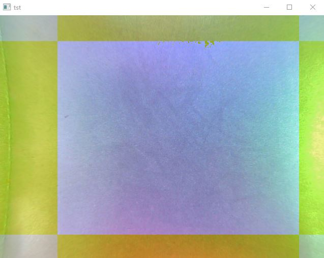
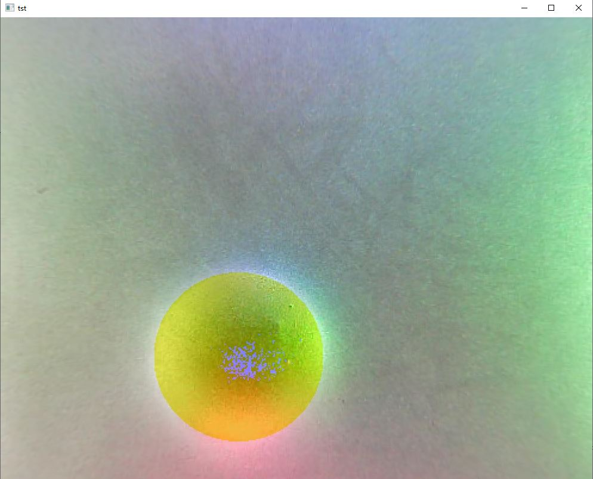

# Gelsight_controller

The part of Gelsight fabrication is included in [How to Make a Gelsight Sensor](https://www.notion.so/How-to-Make-a-Gelsight-Sensor-c051c668869e445690964c401197c212)

This package is for calibrating and applying a Gelsight sensor of Osaka version.

The sensor applies a fisheye camera, so before you do the Gelsight calibration, you have to do fisheye calibration first. 

- Fisheye Calibration

Run program `calibration_fisheye`. This program will collect images from camera, and then calculate the calibration parameter. 
The result will be output into the file `fisheye/camname`. You may change the number of images and the folder according to your requests.
When doing the calibration, you should place a 7*7 chessboard under a camera and ensure the images you take can clearly show the grids. 

After the image is taken from the camera, you can press any key to update it until you think the image is well taken, press SPACE to save it.

The size of the cube doesn't care. For the matter of accuracy, you should try to take images at different angles as many as possible. 
The result is stored in the format of a pkl file.

- Gelsight Calibration

Before you calibrate your Gelsight sensor, you should know the pixel to mm scale and change the value.
To do that, you may run program `pixmm`. You may take a picture of something that you know the exact size, like picture 1tst.jpg in folder fisheye/cam2.
Then, you use your keyboard to control the square yellow area in the picture until it fits the border of the object you took.
then, the program will output the border in pixel. You can change the parameter `pixmm` manually in program `calibrate_gelsight`.

After that, you can start calibrating the Gelsight sensor. Run program `calibrate_gelsight`. 
You need to change the parameters like the radius of the calibration ball `BallRad` and the number of images to take `maxcount` manually. 
Then you are able to take images for calibration. The first image should be initial image, which means nothing should be pressed on the surface.
After that, you need to press the calibration ball onto the gel surface for times and ensure the ball is completely and clearly shown in the image.
When the image collection steps are done, the program will show the initial image with a yellow block on that. 
Use your keyboard to adjust the block to make it cover the area of sensor's sensing surface. 
It is recommended that the marginal area of the sensing surface should be excluded from the block to reduce possible error.
After you figure out the block area, the images you took of the calibration ball would be shown. 
You are able to use your keyboard to make the area of the yellow circle cover the ball in the images. 

After all the images have done, the program will calculate the lookup table and output it as a pickle file. 

- Reconstruction

You can try the reconstruction with the python file `reconst`. Before that, you need a picture taken by the sensor with the object surface you want to reconstruct pressed on it.
You can make use of the funtion `takeimg` in `calibrate_gelsight`.
You can reconstruct the texture in the form of depth img or point cloud. You can also use `gs_controller` to get realtime point cloud. 
To realize it, you need some package from [wrs](https://github.com/wanweiwei07/wrs).

- Contact

hjczgaoyuan@gmail.com